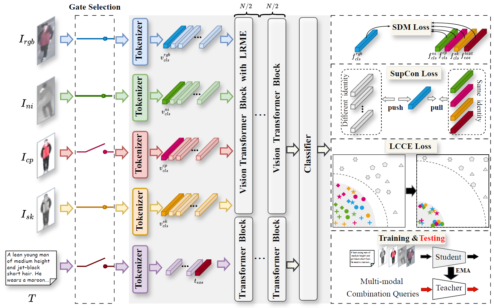
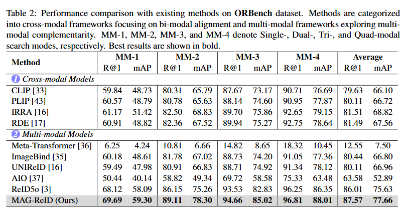
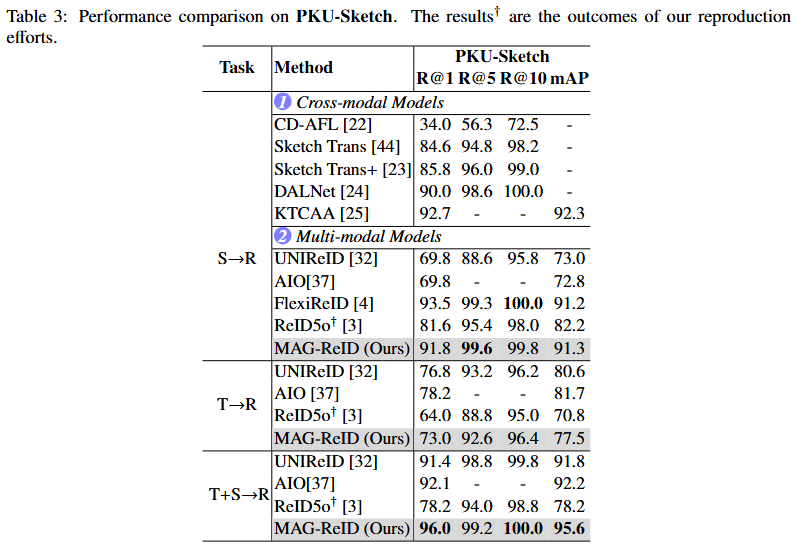
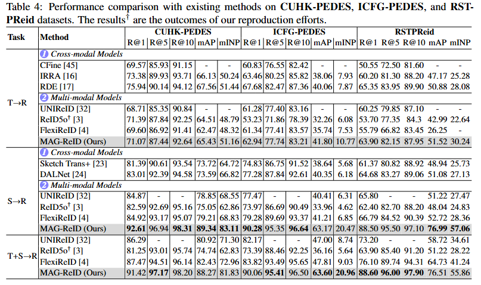
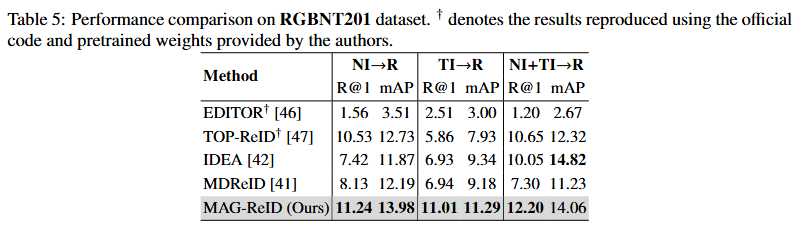
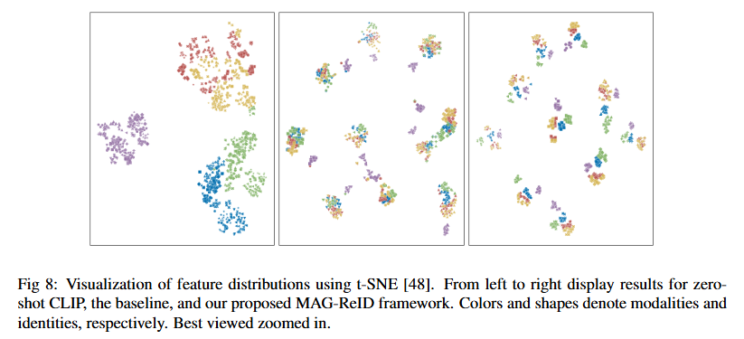
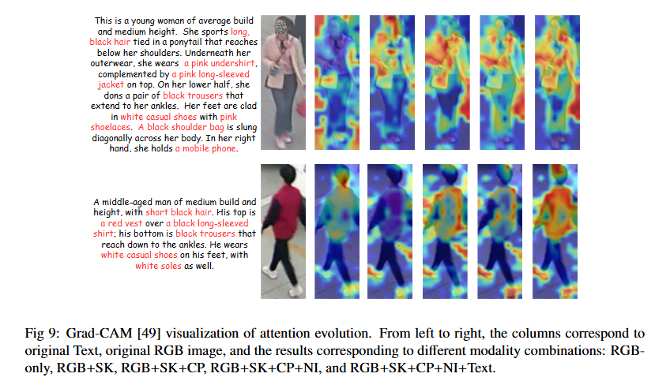
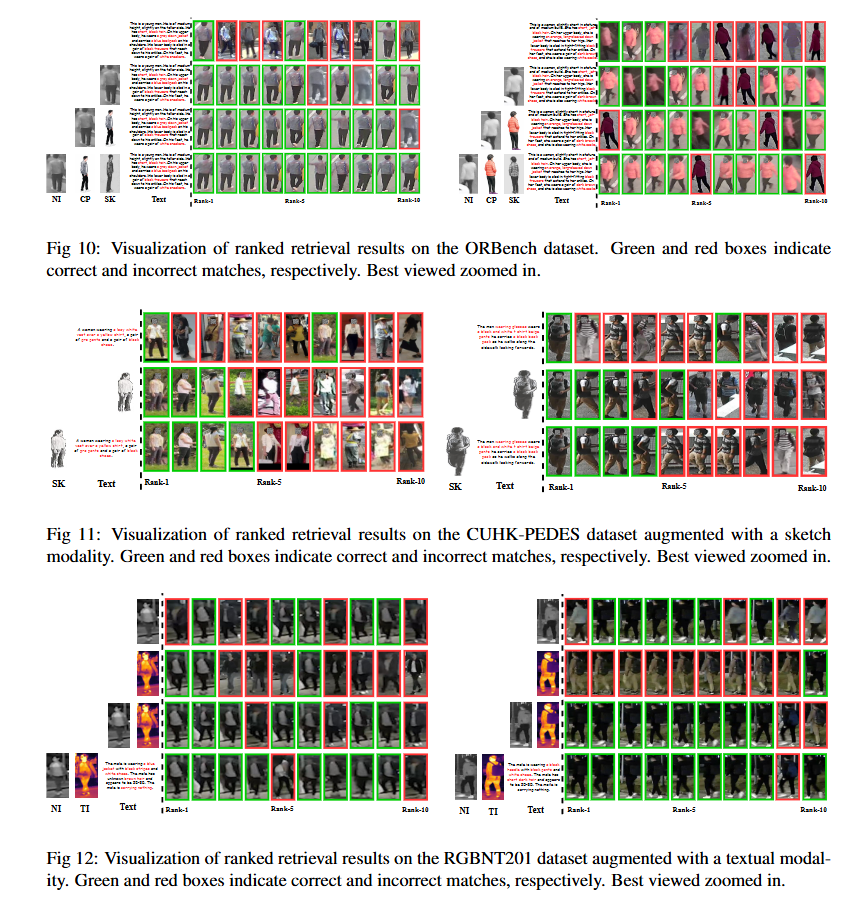

# MAG-ReID

an official code for MAG-ReID

## framework

)

## results

### ORBench

)

### PKU-Sketch

)

### CUHK-PEDES, ICFG-PEDES, RSTP-reid

)

### RGBNT201

)

## Visulization

)

)

)

## `Acknowledgement`

Some components of this code implementation are adopted from [IRRA](https://github.com/anosorae/IRRA) and [Reid5o](https://github.com/Zplusdragon/ReID5o_ORBench) .We sincerely appreciate for their contributions.

## Concat

If you have any question, please feel free to contact me: [dingjin1998@std.uestc.edu.cn](dingjin1998@std.uestc.edu.cn)
